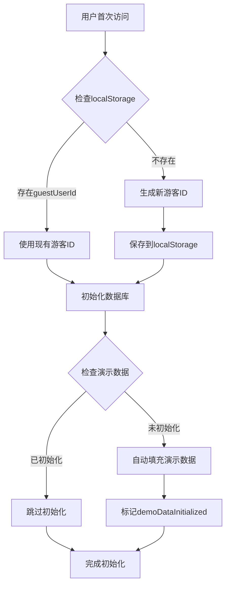

# 游客账户系统实现文档

本文档详细记录了"有钱么"财务应用中游客账户系统的完整实现方案，包括技术架构、功能特性、API接口和使用说明。

## 🎯 系统概述

游客账户系统允许用户无需注册即可体验应用的全部功能，通过设备绑定的方式为每个用户创建独立的游客账户，实现数据隔离和持久化存储。

### 核心特性
- **零注册体验**：用户无需注册即可使用完整功能
- **数据隔离**：每个设备拥有独立的游客账户和数据空间
- **持久化存储**：数据保存在云端数据库，跨会话保持
- **一键重置**：支持清空数据或重新填充演示数据
- **无缝升级**：未来可无缝升级为正式注册用户

## 🔧 技术架构

### 1. 游客ID生成机制

```typescript
// 核心实现位于 apps/web/app/context/UserContext.tsx
const generateGuestId = (): string => {
  return 'guest_' + uuidv4();
};
```

- **生成算法**：使用UUID v4生成唯一标识符
- **前缀标识**：添加`guest_`前缀明确标识游客账户
- **存储位置**：浏览器localStorage中的`guestUserId`键
- **生命周期**：永久保存，除非用户主动清空浏览器数据

### 2. 数据隔离机制

#### HTTP头传递
所有API请求统一通过`x-user-id`头部传递用户标识：

```typescript
// 统一请求配置示例
const headers = {
  'Content-Type': 'application/json',
  'x-user-id': userId, // 游客ID或注册用户ID
};
```

#### 数据库设计
- **用户ID字段**：所有数据表都包含`user_id`字段
- **查询过滤**：所有数据操作都基于`user_id`进行过滤
- **索引优化**：为`user_id`字段建立数据库索引提升查询性能

### 3. 状态管理架构

#### UserContext核心状态
```typescript
interface UserContextType {
  userId: string | null;           // 当前用户ID
  loading: boolean;                // 全局加载状态
  isDemoDataInitialized: boolean;  // 演示数据初始化状态
  
  // 数据操作函数
  clearAllData: () => Promise<void>;
  populateDemoData: () => Promise<void>;
  resetToDemoData: () => Promise<void>;
}
```

#### 本地存储标记
- `guestUserId`: 存储游客ID
- `demoDataInitialized`: 标记演示数据是否已初始化
- `hasClearedData`: 标记用户是否主动清空过数据

## 🚀 功能实现

### 1. 游客账户初始化流程



### 2. 数据清空功能

#### 功能描述
完全清空当前用户的所有数据，包括资产、负债、交易记录等，但保留游客账户本身。

#### 实现逻辑
```typescript
const clearAllData = async () => {
  // 1. 显示Loading状态
  setLoading(true);
  
  try {
    // 2. 调用清空API
    await fetch('/api/settings', {
      method: 'DELETE',
      headers: { 'x-user-id': userId }
    });
    
    // 3. 更新本地状态
    setIsDemoDataInitialized(false);
    localStorage.setItem('hasClearedData', 'true');
    
    // 4. 触发数据刷新
    window.location.reload();
  } finally {
    setLoading(false);
  }
};
```

#### API端点
- **URL**: `/api/settings`
- **方法**: `DELETE`
- **头部**: `x-user-id: {userId}`
- **响应**: `200 OK` 或 `500 Internal Server Error`

### 3. 填充演示数据功能

#### 功能描述
为当前游客账户重新填充完整的演示数据，包含各类资产、负债、交易记录等。

#### 实现逻辑
```typescript
const populateDemoData = async () => {
  // 1. 显示Loading状态
  setLoading(true);
  
  try {
    // 2. 调用演示数据API
    await fetch('/api/demo/reset', {
      method: 'POST',
      headers: { 'x-user-id': userId }
    });
    
    // 3. 更新本地状态
    setIsDemoDataInitialized(true);
    
    // 4. 触发数据刷新
    window.location.reload();
  } finally {
    setLoading(false);
  }
};
```

#### API端点
- **URL**: `/api/demo/reset`
- **方法**: `POST`
- **头部**: `x-user-id: {userId}`
- **响应**: `200 OK` 或 `500 Internal Server Error`

### 4. 重置为演示数据功能

#### 功能描述
先清空所有现有数据，然后重新填充演示数据，相当于恢复出厂设置。

#### 实现逻辑
```typescript
const resetToDemoData = async () => {
  setLoading(true);
  
  try {
    // 1. 先清空数据
    await clearAllData();
    
    // 2. 再填充演示数据
    await populateDemoData();
  } finally {
    setLoading(false);
  }
};
```

## 🎨 用户界面

### 1. 游客模式提示条

#### 组件位置
`apps/web/app/components/DemoBanner.tsx`

#### 界面元素
- **提示信息**: "当前为游客模式，数据仅保存在当前设备"
- **清空数据按钮**: 红色警告样式，确认后清空所有数据
- **填充演示数据按钮**: 蓝色主色调，一键恢复演示数据
- **Loading状态**: 全屏遮罩，防止重复操作

#### 交互设计
- **按钮禁用**: 操作进行中禁用所有按钮
- **确认对话框**: 清空数据前显示确认提示
- **成功反馈**: 操作完成后自动刷新页面

### 2. Loading状态管理

#### 全屏Loading组件
```typescript
const FullScreenLoading = () => (
  <div className="fixed inset-0 bg-black bg-opacity-50 flex items-center justify-center z-50">
    <div className="bg-white p-6 rounded-lg shadow-lg">
      <div className="animate-spin rounded-full h-8 w-8 border-b-2 border-blue-600 mx-auto"></div>
      <p className="mt-2 text-sm text-gray-600">正在处理中...</p>
    </div>
  </div>
);
```

## 📊 数据模型

### 1. 用户标识模型
```typescript
interface UserData {
  user_id: string;      // 游客ID或注册用户ID
  created_at: Date;     // 创建时间
  updated_at: Date;     // 更新时间
  is_guest: boolean;    // 是否为游客账户
}
```

### 2. 数据隔离规则
- **资产数据**: 按`user_id`过滤
- **负债数据**: 按`user_id`过滤  
- **交易记录**: 按`user_id`过滤
- **用户设置**: 按`user_id`过滤

## 🔍 调试与测试

### 1. 本地测试方法

#### 测试游客账户创建
```bash
# 1. 清除浏览器localStorage
# 2. 访问应用首页
# 3. 检查localStorage中的guestUserId
# 4. 验证数据库中创建了对应用户记录
```

#### 测试数据隔离
```bash
# 1. 使用浏览器A访问应用
# 2. 添加一些测试数据
# 3. 使用浏览器B访问应用（或使用隐私模式）
# 4. 验证两个浏览器看到的数据完全独立
```

#### 测试清空数据功能
```bash
# 1. 确认当前有演示数据
# 2. 点击"清空数据"按钮
# 3. 确认所有数据被清空
# 4. 验证localStorage中的标记状态
```

#### 测试填充演示数据功能
```bash
# 1. 清空所有数据
# 2. 点击"填充演示数据"按钮
# 3. 验证演示数据完整恢复
# 4. 检查各类数据是否符合预期
```

### 2. 常见问题排查

#### 问题1: 游客ID未生成
**症状**: localStorage中没有guestUserId
**解决**: 检查UserContext初始化逻辑，确认uuid库正常加载

#### 问题2: 数据未正确隔离
**症状**: 不同用户看到相同数据
**解决**: 检查所有API请求是否包含x-user-id头部

#### 问题3: 清空数据后自动恢复
**症状**: 清空数据后页面刷新又出现演示数据
**解决**: 检查hasClearedData标记是否正确设置

## 🔄 未来扩展

### 1. 账户升级路径
```typescript
interface AccountUpgrade {
  from: 'guest';
  to: 'registered';
  data_migration: boolean;  // 是否迁移游客数据
  email_verification: boolean;
}
```

### 2. 多设备同步
- **设备绑定**: 通过邮箱或手机号绑定多个设备
- **数据合并**: 支持多设备数据合并策略
- **冲突解决**: 提供数据冲突解决界面

### 3. 数据导出功能
- **格式支持**: CSV、JSON、PDF
- **数据范围**: 支持选择时间范围和数据类型
- **隐私保护**: 敏感信息脱敏处理

## 📋 更新日志

### v1.0.0 (2026-02-28)
- ✅ 实现游客账户系统核心功能
- ✅ 添加数据隔离机制
- ✅ 实现清空数据和填充演示数据功能
- ✅ 添加全屏Loading状态
- ✅ 完成用户界面优化
- ✅ 添加完整的错误处理和边界情况处理

## 🔗 相关文件

### 核心实现文件
- `apps/web/app/context/UserContext.tsx` - 用户状态管理
- `apps/web/app/components/DemoBanner.tsx` - 游客模式UI组件
- `apps/web/app/api/settings/route.ts` - 数据清空API
- `apps/web/app/api/demo/reset/route.ts` - 演示数据重置API

### 数据库相关
- `packages/data-access/src/database/manager.ts` - 数据库管理器
- `packages/data-access/src/repositories/` - 各数据仓库实现

### 类型定义
- `packages/types/index.ts` - 共享类型定义
- `apps/web/app/types/` - Web端特定类型

---

**文档维护**: 随着系统演进，本文档将持续更新以反映最新实现状态。